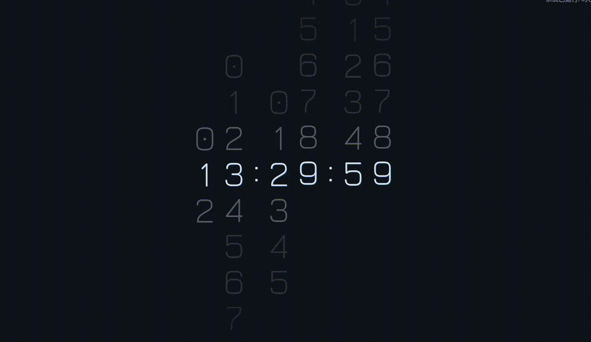

# qt.scroll-number-clock-screensaver

> 适用于深度操作系统的屏保滚动数字时钟程序

## 屏保演示

* 在配置好屏幕保护设置后，执行 `deepin-screensaver` 即可立即预览屏保效果\
    

## 定制说明

- 基于 「[mimicry-clock-screensaver][mimicry-clock-screensaver]」程序框架资源替换修改

[mimicry-clock-screensaver]: https://gitee.com/zinface/qt.mimicry-clock-screensaver
